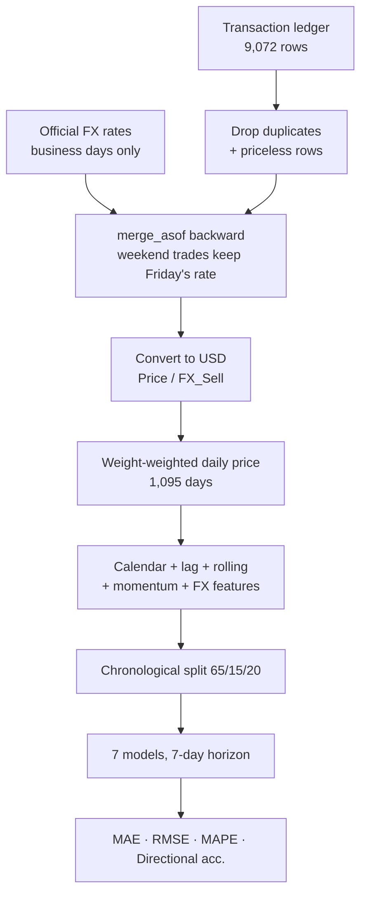

# Bale Price Forecasting

Forecasting recycled-plastic (PET) bale prices for a procurement desk operating
through Egypt's **89% currency devaluation** — where the hard part is separating a
real commodity price signal from a collapsing exchange rate.

<p align="left">
  
  
  
  
</p>

---

## The core problem: the price that rose 293% didn't rise at all

Across 2021-2023 the nominal bale price went from **5.09 to 20.01 EGP/kg**. Over the
same window the Egyptian pound fell from **15.69 to 29.71 per USD**.

Most of that "price increase" is the currency. In USD the real price moved from
**0.323 to 0.674/kg** — a genuine rise, but a completely different series with
different dynamics. A model fitted to nominal EGP prices spends its capacity learning
the devaluation schedule and calls it plastic.


Everything downstream models `Unit_Price_in_USD = Price_EGP / FX_Sell`.

## Results

**7-day-ahead** forecasts. Every feature is lagged by at least 7 days, so nothing enters
the model that wouldn't exist at forecast time.

| Model | MAE | RMSE | MAPE | Directional acc. |
|---|---:|---:|---:|---:|
| Notebook baseline (calendar only, `lr=1e-6`) | 0.0534 | 0.0674 | 10.22% | 62.3% |
| Naive (random walk) | 0.0350 | 0.0447 | 7.17% | n/a |
| Seasonal naive (28d) | 0.0395 | 0.0493 | 8.07% | 61.4% |
| **Rolling mean (14d)** | **0.0280** | **0.0349** | **5.75%** | 68.1% |
| Ridge (calendar + lags) | 0.0290 | 0.0366 | 5.92% | 66.7% |
| XGBoost (calendar + lags) | 0.0375 | 0.0488 | 7.26% | 65.7% |
| XGBoost on price change (Δ target) | 0.0300 | 0.0381 | 5.97% | 64.3% |

Five-fold expanding-window backtest:

| Model | MAE | RMSE | MAPE | Directional acc. |
|---|---:|---:|---:|---:|
| Naive (random walk) | 0.0342 | 0.0427 | 7.32% | n/a |
| **Rolling mean (14d)** | **0.0281** | **0.0342** | 6.00% | 68.7% |
| Ridge (calendar + lags) | 0.0288 | 0.0354 | 6.15% | 66.0% |
| XGBoost on price change (Δ target) | 0.0287 | 0.0348 | 6.09% | **70.0%** |


### The headline finding: a 14-day rolling mean wins

**Gradient boosting does not beat a two-line baseline here, and this is the most useful
thing the project has to say.** Commodity prices are close to random walks; there is
little exploitable structure at a 7-day horizon beyond "the price is roughly where it
recently was." Smoothing captures that. A 800-tree ensemble captures it too, plus noise.

That result survived a real attempt to overturn it:

**Attempt 1 — XGBoost on the price level: 0.0375 MAE, *worse than the random walk*.**
Trees predict a weighted average of training leaf values, so they cannot output a level
they never saw. On an upward-trending price they are structurally biased low.

**Attempt 2 — XGBoost on the price *change* (`y − lag₇`): 0.0300 MAE.** Reframing the
target removes the trend from what the model must learn; the residual is roughly
stationary, which is the regime trees handle well. A 20% error reduction, and enough to
beat the random walk — but still behind the rolling mean.

So the honest conclusion is that **the ML model is not worth deploying for point
forecasts.** It earns its place on one metric only: in the backtest it has the best
directional accuracy (70.0% vs 68.7%), and for a procurement desk deciding *whether to
buy ahead*, direction can matter more than magnitude. That is the argument for keeping
it — not the MAPE.

### What the original notebook got wrong

The notebook is reproduced verbatim as `NotebookBaseline` so the gap is measured, not
asserted. It scores **0.0534 MAE / 10.22% MAPE — worse than every baseline including
"the price is whatever it was last week."** Two independent causes:

**`learning_rate = 0.000001` with `n_estimators = 100`.** Each tree moves the ensemble
one ten-thousandth of a percent toward the residual. After 100 trees the model has
barely left its initial constant prediction — it is an expensive way to predict the
training mean.

**Calendar-only features, including `Year`.** `Year` is monotonic: its test-set value
(2023) never appears in training, so every tree falls into the `Year <= 2022` leaf and
returns a 2022-level price. On a rising series that biases every forecast low, and no
tuning fixes it — the information is not in the feature set. `Year` is now excluded, and
[a test enforces that](tests/test_features.py). `month` and `dayofyear` stay, because
genuinely repeating seasonality is a different thing from a monotone counter.

## Pipeline



### Decisions worth calling out

**`merge_asof`, not a join.** The FX sheet is published on business days only. An inner
join silently discards every weekend transaction; `merge_asof(direction="backward")`
carries Friday's rate onto Saturday's trade, which is what actually applies.

**The daily price is weight-weighted, not a plain mean.** A 400 kg lot and a 30-tonne lot
are not equally informative about the market price. An unweighted mean lets a tiny trade
swing the series as much as a truckload.

**Non-trading days are forward-filled.** The market price does not cease to exist on a
quiet Friday; the observation does.

**Directional accuracy is reported as `n/a` for the random walk.** It predicts exactly
the last known value, so it never calls a direction. Scoring that 0% would read as
"always wrong" when the truth is "never answered."


## Quickstart

```bash
git clone https://github.com/yasmine-ali101/bale-price-forecasting.git
cd bale-price-forecasting

python -m venv .venv && source .venv/bin/activate   # Windows: .venv\Scripts\activate
pip install -r requirements.txt

python scripts/run_experiment.py    # regenerates every number and plot above
pytest                              # 19 tests
```

Runs in well under a minute.

## About the data

The original study used a private ledger from a plastics recycler (2021-2023, three
annual sheets) plus official EGP/USD rates. Neither can be redistributed, so
[`src/bales/data.py`](src/bales/data.py) generates a seeded sample with the same schema
and the same economics — including the three real devaluation steps (March 2022,
October 2022, January 2023), category price premiums, duplicate rows, and missing prices.

**Every metric on this page is measured on that generated sample.** The generator is
seeded, so `python scripts/run_experiment.py` reproduces the tables exactly.

## Project structure

```
src/bales/
├── data.py            # seeded ledger + FX generator
├── preprocessing.py   # dedup, FX merge, USD conversion, weighted daily series
├── features.py        # calendar, lag, rolling, momentum, FX features + leakage guards
├── models.py          # notebook baseline, naives, Ridge, XGBoost (level and Δ)
└── evaluation.py      # metrics incl. directional accuracy, splits, backtest
scripts/run_experiment.py
notebooks/             # original research notebook
results/               # metrics.json, metrics.md, plots (regenerated)
tests/                 # 19 tests
```

## Limitations

- **Results are on generated data.** The generator encodes the devaluation structure and
  an AR(1) price wander; the relative model ordering follows from that structure and
  should transfer, but absolute errors are properties of the sample.
- **No exogenous drivers.** Virgin PET resin prices, crude oil, and export demand all
  move this market and none are included. That is the most likely source of real
  improvement — far more than model choice.
- **One horizon.** Everything is 7-day-ahead. The original objective was quarterly
  forecasting, which is a much harder problem and would need a different approach.
- **Point forecasts only.** A procurement desk would want intervals.
- **Directional accuracy is measured, not backtested as a strategy.** 70% sounds
  actionable; whether it survives transaction costs and slippage is untested.

## Notes on scope

Built from a coursework notebook that ended at an untuned XGBoost fit with no metrics
reported. The FX normalisation, feature engineering, evaluation protocol, baselines,
test suite, and packaging were added here.

## License

[MIT](LICENSE)
