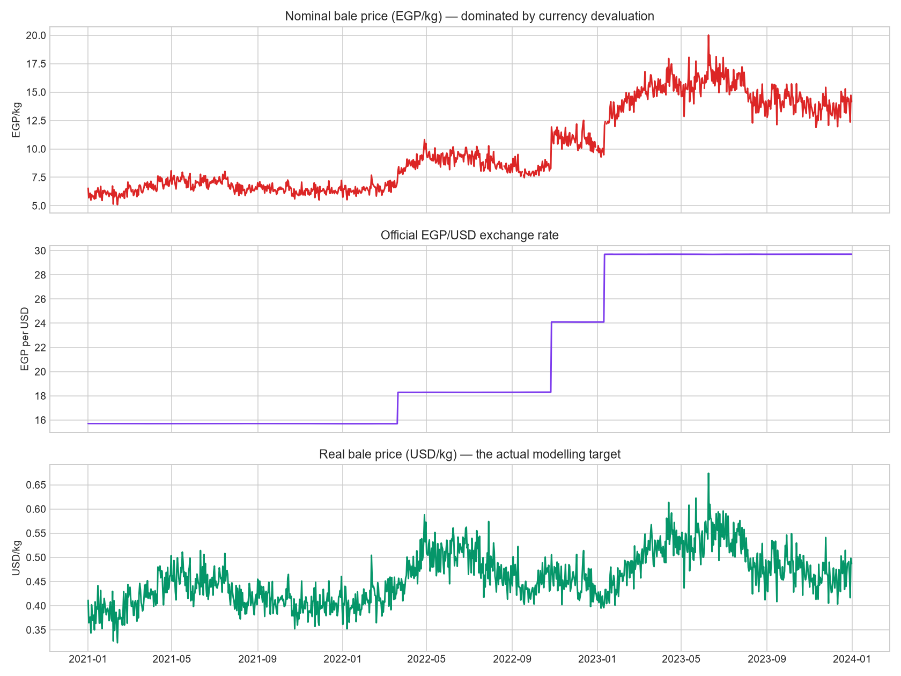
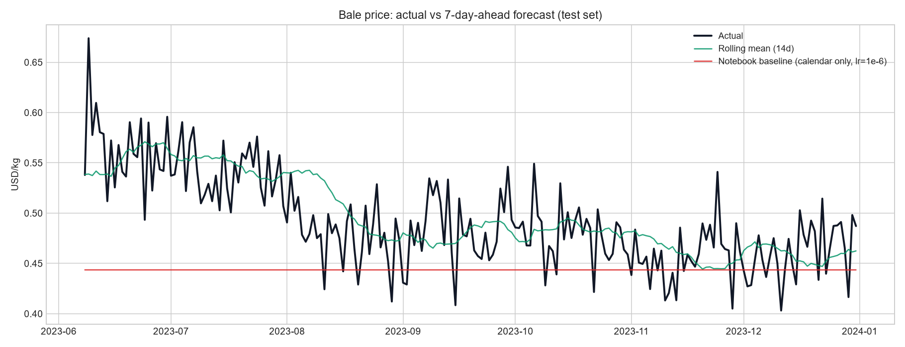
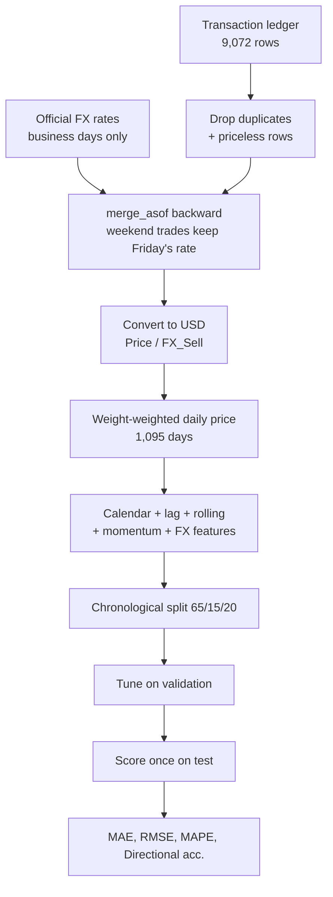
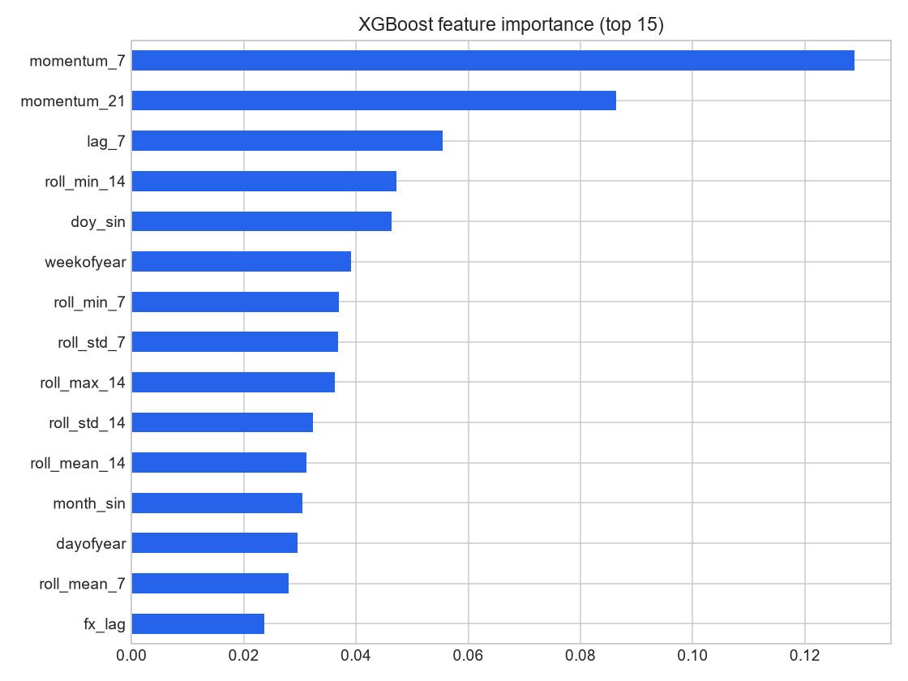

# Bale Price Forecasting

Forecasting recycled-plastic (PET) bale prices for a procurement desk operating through
Egypt's **89% currency devaluation**, where the hard part is separating a real commodity
price signal from a collapsing exchange rate.

<p align="left">
  
  
  
  
</p>

---

## The core problem: the price that rose 293% did not rise at all

Across 2021 to 2023 the nominal bale price went from **5.09 to 20.01 EGP/kg**. Over the
same window the Egyptian pound fell from **15.69 to 29.71 per USD**.

Most of that "price increase" is the currency. In USD the real price moved from **0.323 to
0.674 per kg**, a genuine rise but a completely different series with different dynamics. A
model fitted to nominal EGP prices spends its capacity learning the devaluation schedule
and calls it plastic.



Everything downstream models `Unit_Price_in_USD = Price_EGP / FX_Sell`.

## Results

**7-day-ahead** forecasts. Every feature is lagged by at least 7 days, so nothing enters
the model that would not exist at forecast time.

| Model | MAE | RMSE | MAPE | Directional acc. |
|---|---:|---:|---:|---:|
| Notebook baseline (calendar only, `lr=1e-6`) | 0.0534 | 0.0674 | 10.22% | 62.3% |
| Naive (random walk) | 0.0350 | 0.0447 | 7.17% | n/a |
| Seasonal naive (28d) | 0.0395 | 0.0493 | 8.07% | 61.4% |
| XGBoost (calendar + lags, untuned) | 0.0375 | 0.0488 | 7.26% | 65.7% |
| Ridge (calendar + lags) | 0.0290 | 0.0366 | 5.92% | 66.7% |
| XGBoost on price change (tuned) | 0.0294 | 0.0377 | 5.87% | 65.2% |
| **Rolling mean (14d)** | **0.0280** | **0.0349** | **5.75%** | **68.1%** |

Five-fold expanding-window backtest:

| Model | MAE | RMSE | MAPE | Directional acc. |
|---|---:|---:|---:|---:|
| Naive (random walk) | 0.0342 | 0.0427 | 7.32% | n/a |
| Ridge (calendar + lags) | 0.0288 | 0.0354 | 6.15% | 66.0% |
| XGBoost on price change (tuned) | 0.0285 | 0.0347 | 6.06% | 65.3% |
| **Rolling mean (14d)** | **0.0281** | **0.0342** | 6.00% | **68.7%** |



## What we tried, in order

The model was improved through four rounds. Each one is kept in the codebase so the
reasoning is auditable rather than asserted.

| # | Approach | Test MAE | Outcome |
|---|---|---:|---|
| 1 | Notebook original: calendar features, `lr=1e-6` | 0.0534 | Worse than every baseline |
| 2 | Fix the learning rate, add lag and rolling features | 0.0375 | Better, still worse than a random walk |
| 3 | Reframe the target as the **price change** rather than the level | 0.0300 | 20% better, now beats the random walk |
| 4 | Grid search, 120 configurations, on validation only | 0.0294 | Marginal further gain |
| | **A 14-day rolling mean** | **0.0280** | **Still the best model** |

### Round 1 to 2: what the notebook got wrong

The notebook's configuration is reproduced verbatim as `NotebookBaseline` so the gap is
measured rather than asserted. Two independent causes:

**`learning_rate = 0.000001` with `n_estimators = 100`.** Each tree moves the ensemble one
ten-thousandth of a percent toward the residual. After 100 trees the model has barely left
its initial constant prediction, making it an expensive way to predict the training mean.

**Calendar-only features, including `Year`.** `Year` is monotonic, so its test-set value
(2023) never appears in training and every tree falls into the `Year <= 2022` leaf,
returning a 2022-level price. On a rising series that biases every forecast low, and no
tuning fixes it because the information is not in the feature set. `Year` is now excluded,
and [a test enforces that](tests/test_features.py).

### Round 3: predicting the change, not the level

Trees predict a weighted average of training leaf values, so they cannot output a level
they never saw. On an upward-trending price they are structurally biased low.

Reframing the target as `y - lag7` removes the trend from what the model has to learn. The
residual is roughly mean-zero and stationary, which is the regime trees handle well. This
was the single largest improvement in the whole project, a 20% error reduction, and it came
from changing the *target* rather than the model.

### Round 4: the tuning result is itself the finding

[`scripts/tune.py`](scripts/tune.py) searches 120 configurations across depth, learning
rate, estimator count, subsampling and regularisation, **scored on the validation split
only**. The test split is never consulted during the search, because selecting a
configuration by its test score turns the reported number from an estimate of unseen
performance into a record of how many configurations were tried.

Tuning bought 0.0300 to 0.0294 MAE. More informative is *which* configurations won: every
one of the top five is **shallow (depth 2 to 3) with heavy L2 regularisation**
(`reg_lambda=10`). The search is pushing the model as far toward a smoother as the grid
allows. That is what you would expect when the series holds little exploitable nonlinear
structure at this horizon, and it is direct evidence for the conclusion below.

## The honest conclusion

**A 14-day rolling mean is the best forecaster here, and it survived a genuine attempt to
beat it.** Four rounds of improvement, a 120-configuration search, a target reframing, and
a linear alternative all failed to displace two lines of code.

That is not a modelling failure. Commodity prices are close to random walks, and at a
7-day horizon there is little exploitable structure beyond "the price is roughly where it
recently was". Smoothing captures exactly that. A boosted ensemble captures it too, plus
noise.

**The ceiling here is the data, not the model.** The way past it is more information rather
than more capacity: virgin PET resin prices, crude oil, and export demand all move this
market and none are in the feature set. That is where a real improvement would come from.

**Where the tuned model does earn its place:** directional accuracy. For a procurement desk
deciding *whether to buy ahead*, calling the direction can matter more than the magnitude,
and the tuned model tracks it competitively at 65 to 68%. But the rolling mean wins there
too (68.1% on test, 68.7% in backtest), so the honest recommendation is to **deploy the
rolling mean** and keep the tree only if a richer feature set becomes available.

## Pipeline



### Decisions worth calling out

**`merge_asof`, not a join.** The FX sheet is published on business days only. An inner
join silently discards every weekend transaction, while
`merge_asof(direction="backward")` carries Friday's rate onto Saturday's trade, which is
what actually applies.

**The daily price is weight-weighted, not a plain mean.** A 400 kg lot and a 30-tonne lot
are not equally informative about the market price. An unweighted mean lets a tiny trade
swing the series as much as a truckload.

**Non-trading days are forward-filled.** The market price does not cease to exist on a
quiet Friday, only the observation does.

**Directional accuracy is reported as `n/a` for the random walk.** It predicts exactly the
last known value, so it never calls a direction. Scoring that 0% would read as "always
wrong" when the truth is "never answered".



## Quickstart

```bash
git clone https://github.com/yasmine-ali101/bale-price-forecasting.git
cd bale-price-forecasting

python -m venv .venv && source .venv/bin/activate   # Windows: .venv\Scripts\activate
pip install -r requirements.txt

python scripts/run_experiment.py    # regenerates every number and plot above
python scripts/tune.py              # re-runs the 120-configuration search
pytest                              # 19 tests
```

The experiment runs in under a minute, the search in a few minutes.

## About the data

The original study used a private ledger from a plastics recycler covering 2021 to 2023
across three annual sheets, plus official EGP/USD rates. Neither can be redistributed, so
[`src/bales/data.py`](src/bales/data.py) generates a seeded sample with the same schema and
the same economics, including the three real devaluation steps (March 2022, October 2022,
January 2023), category price premiums, duplicate rows, and missing prices.

**Every metric on this page is measured on that generated sample.** The generator is
seeded, so `python scripts/run_experiment.py` reproduces the tables exactly.

## Project structure

```
src/bales/
├── data.py            # seeded ledger + FX generator
├── preprocessing.py   # dedup, FX merge, USD conversion, weighted daily series
├── features.py        # calendar, lag, rolling, momentum, FX features + leakage guards
├── models.py          # notebook baseline, naives, Ridge, XGBoost (level and change)
└── evaluation.py      # metrics incl. directional accuracy, splits, backtest
scripts/
├── run_experiment.py  # end-to-end run, writes results/
└── tune.py            # 120-configuration search on validation only
notebooks/             # original research notebook
results/               # metrics.json, tuning.json, plots (regenerated)
tests/                 # 19 tests
```

## Limitations

- **Results are on generated data.** The generator encodes the devaluation structure and an
  AR(1) price wander. The relative model ordering follows from that structure and should
  transfer, but absolute errors are properties of the sample.
- **No exogenous drivers**, which is the single biggest gap. Virgin PET resin prices, crude
  oil, and export demand all move this market and none are included.
- **One horizon.** Everything is 7-day-ahead. The original objective was quarterly
  forecasting, a much harder problem needing a different approach.
- **Point forecasts only.** A procurement desk would want intervals.
- **Directional accuracy is measured, not backtested as a strategy.** 68% sounds actionable,
  but whether it survives transaction costs and slippage is untested.

## Notes on scope

Built from a coursework notebook that ended at an untuned XGBoost fit with no metrics
reported. The FX normalisation, feature engineering, evaluation protocol, baselines,
hyperparameter search, test suite, and packaging were added here.

## License

[MIT](LICENSE)
